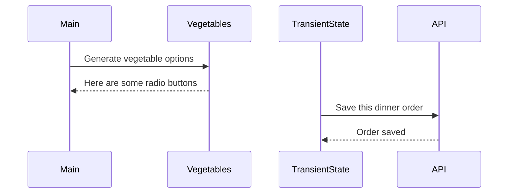

# Events and State Self-Assessment

> 🧨 Make sure you answer the vocabulary and understanding questions at the end of this document before notifying your coaches that you are done with the project

## Setup

1. Make sure you are in your `workspace` directory
1. `git clone {github repo SSH string}`
1. `cd` into the directory it creates
1. `code .` to open the project code
1. Use the `serve` command to start the web server
1. Open the URL provided in Chrome

## Requirements

### Initial Render

1. All 10 base dishes should be displayed as radio input options.
1. All 9 vegetables should be displayed as radio input options.
1. All 6 side dishes should be displayed as radio input options.
1. All previously purchases meals should be displayed below the meal options. Each purchase should display the primary key and the total cost of the purcahsed meal.

### State Management

1. When the user selects an item in any of the three columns, the choice should be stored as transient state.
1. When a user makes a choice for all three kinds of food, and then clicks the "Purchase Combo" button, a new sales object should be...
    1. Stored as permanent state in your local API.
    1. Represented as HTML below the **Monthly Sales** header in the following format **_exactly_**. Your output will not have zeroes, but the actual amount.
        ```html
        Receipt #1 = $00.00
        ```
   1. The user's choices should be cleared from transient state once the purchase is made.

## Design

Given the description and animation above...

1. Create an ERD for this application before you begin.
1. Make a list of what modules need to be created to make your application as modular as possible. Create a **Dependency Graph** for the project to be reviewed once you are complete with the assessment.
1. Create a **Sequence Diagram** that visualizes what your algorithm is for this project. We'll give you a minimal starting point.



## Vocabulary and Understanding

> 🧨 Before you click the "Assessment Complete" button on the Learning Platform, add your answers below for each question and make a commit. It is your option to request a face-to-face meeting with a coach for a vocabulary review.

1. Should transient state be represented in a database diagram? Why, or why not?
   > No the transient state should not be in a database diagram, because it is a temporary placeholder for the "purchases" array objects and it is setting up which properties they will contain when they are generated by placing an order. The permanent state of those purchases is included in the database diagram as the "purchases" array with a primary key of "id" and 3 foreign keys for entreeId, vegetableId, and sideId. 

2. In the **FoodTruck** module, you are **await**ing the invocataion of all of the component functions _(e.g. sales, veggie options, etc.)_. Why must you use the `await` keyword there? Explain what happens if you remove it.
   > I must use the "await" keyword because the FoodTruck function is an asynchronous function, and the functions being invoked inside it are accessing data from a json database, so I need to "await" each of those functions (besides the purchase button function because it does not need to access the database). Without using the "await" keyword, the functions would return promise objects, instead of waiting for the data I am trying to return in each function.

3. When the user is making choices by selecting radio buttons, explain how that data is retained so that the **Purchase Combo** button works correctly.
   > The data for each selection is retained in the TransientState.js module. In that module I am setting up the properties that I want to be displayed in each purchase object, and I have it set up so each purchase object has it's own primary key of "id", and also foreign keys for each option that can be chosen (entreeId, vegetableId, and sideId). Then I have 3 functions for each option that take the chosen option as a parameter and sets the transientState property of the corresponding option foreign key equal to the id of the chosen option. For example, to change the entree option, my function takes the "chosenEntree" as a parameter and sets the entreeId foreign key of the transientState that I set up initially equal to the id property of that "chosenEntree" object. I am exporting each of those 3 functions into their corresponding modules, and invoking the functions inside a handleChange function that checks if the event.target.name is equal to the name property of that particular input/radio button, then it uses the imported function with an argument of the event.target.value, which is set equal to the id property of whichever radio button was clicked, and I used parseInt on that value to convert the string to an integer.

4. You used the `map()` array method in the self assessment _(at least, you should have since it is a learning objective)_. Explain why that function is helpful as a replacement for a `for..of` loop.
   > I used .map() to iterate through the database and create a copy of the array I am accessing inside the database (so that I don't alter the original data) and then return an html input for each individual object inside that array.
